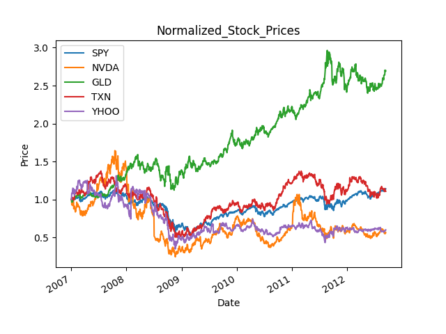
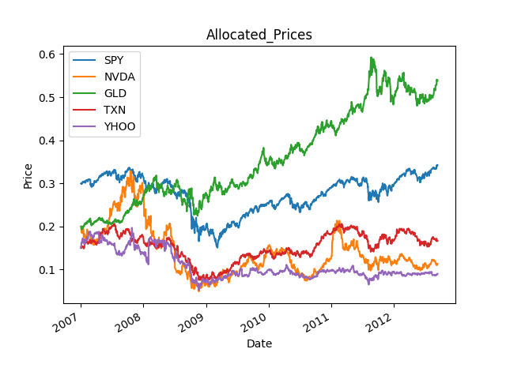
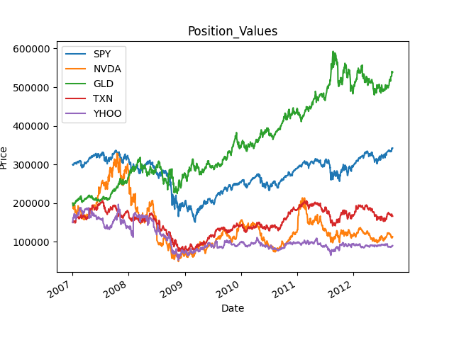
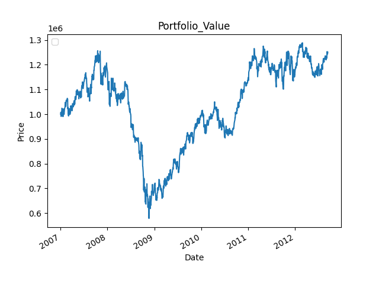
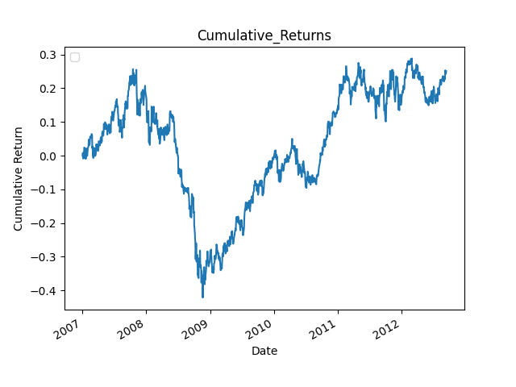

# 📈 Portfolio Performance Analyzer

This Python project calculates key portfolio performance metrics and generates visualizations for historical financial data. It simulates portfolio allocation over time, visualizes asset behavior, and saves plots automatically for presentation or analysis.

---

## 🚀 Features

- 📥 Loads historical stock data from CSV files
- 🧮 Calculates:
  - Daily returns
  - Cumulative returns
  - Average daily return
  - Daily volatility (standard deviation)
  - Sharpe ratio (assuming risk-free rate = 0)
- 🧩 Handles allocation, normalization, and position valuation
- 📊 Generates and **saves charts**:
  - Raw prices
  - Normalized values
  - Allocated values
  - Position values
  - Portfolio value over time
  - Cumulative returns

---

## 📁 Folder Structure

```
project/
├── data/
│   ├── SPY.csv
│   ├── NVDA.csv
│   ├── GLD.csv
│   ├── TXN.csv
│   └── YHOO.csv
├── images/
│   ├── Stock Prices.png
│   ├── Normalized_Stock_Prices.png
│   ├── Allocated_Prices.png
│   ├── Position_Values.png
│   ├── Portfolio_Value.png
│   └── Cumulative_Returns.png
├── portfolio_analyzer.py
└── README.md
```

---

## 🖼️ Output Charts

### 📊 Raw Stock Prices


### 📈 Normalized Stock Prices



### 📐 Allocated Prices



### 🧮 Position Values



### 💼 Portfolio Value



### 📈 Cumulative Returns



---

## 🧪 Console Output Sample

Portolio Statistics
Average Daily Return: 0.000489
Average Daily Standard Deviation (Risk): 0.0103
Sharpe Ratio: 0.763

## 🧭 Step-by-Step Process (Referencing the Numbered Code)

Inside the portfolio_stats() function:

1. Get Adjusted Closing Prices
   Loads CSV data for each ticker over the specified date range and joins them into one DataFrame. It ensures 'SPY' is always included to define the trading calendar.

2. Normalize Prices
   Each stock's price is divided by its initial value to transform it to a common scale. This lets us compare relative performance starting from 1.0.

3. Apply Allocations
   Multiplies each normalized price series by its corresponding weight in the portfolio to reflect its capital allocation.

4. Compute Position Values
   Each allocated series is multiplied by the starting investment ($1,000,000) to get the dollar value of each holding per day.

5. Calculate Daily Portfolio Value
   Sums up all position values across all tickers to get the total portfolio value for each day.

## 📈 Performance Metrics

After computing the daily portfolio value, the script calculates:

- Cumulative Return: Overall growth from start to end of the period.

- Average Daily Return: Mean of the daily returns.

- Risk (Standard Deviation): Volatility of daily returns.

- Sharpe Ratio: Risk-adjusted return, assuming risk-free rate = 0.

All of these are printed to the console and visualized.
